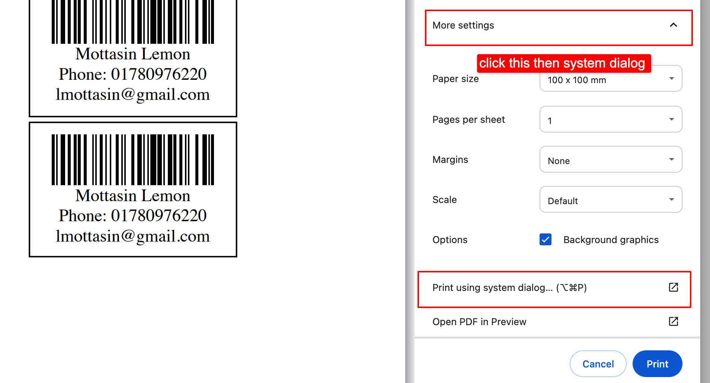
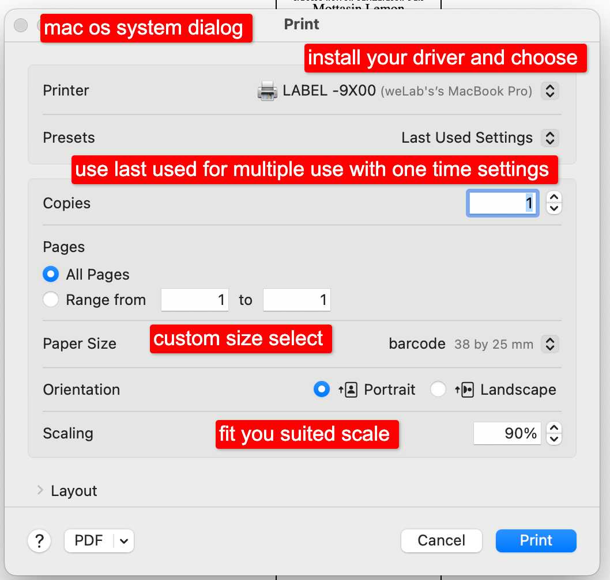
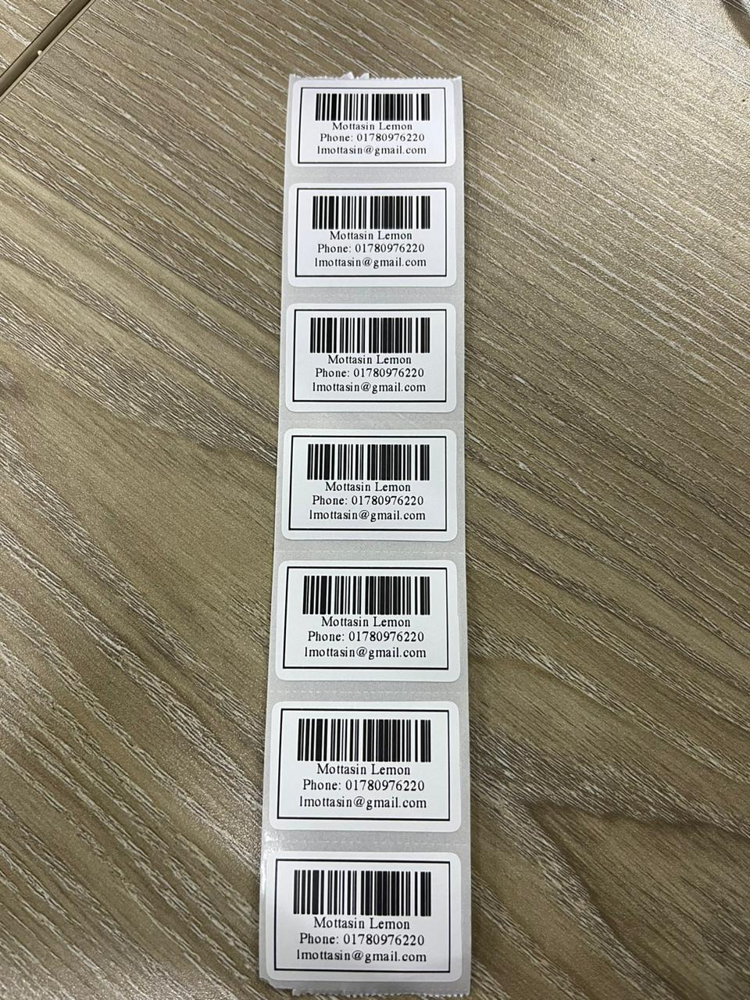
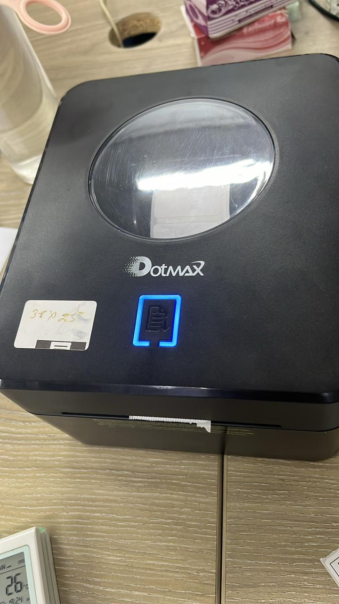

# Requirements:
* We are using `milon/barcode` package to generate barcode. So, This package relies on `php-gd` extension. So, make sure it is installed on your machine.
* PHP 7.0 or higher

# Installation:
* Run `composer install` to install the package.
* Run `php -S localhost:8000` to start the server.
* Open `http://localhost:8000` in your browser.
* Or, put the files in your server's root directory and open the URL in your browser.

# Printing Settings in device: 
* Install the printer driver in your device. for Dotmax printer macOS see driver folder.
* Create a custom paper size in your printer settings [for mac](https://support.apple.com/en-ke/guide/mac-help/mchlp15541/mac) with the following dimensions:
  * Width: 38 mm
  * Height: 25 mm
  * Margins: 0 mm (all sides)
* Don't use the browser print option open the system print dialog and select the custom paper size you created.
* Or use the shortcut for the system print dialog for Macos its `command + option + p`
* 
* Change you scale to 80 to 100% to fit the barcode in the paper.
* Make sure the paper size is set to the custom paper size you created.
* 

# Usage:

